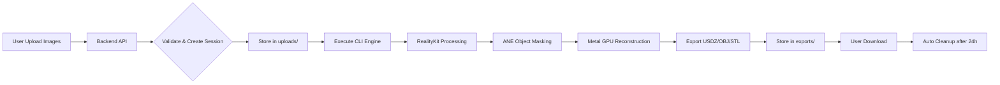

# 📸 HeyPhom

> Transform your Mac into a powerful 3D Photogrammetry processing server

[](https://www.apple.com/macos)
[](https://swift.org)
[](https://nodejs.org)
[](https://developer.apple.com/documentation/realitykit)

**HeyPhom** is an open-source photogrammetry platform that converts photos into high-quality 3D models (OBJ, USDZ, STL) using Apple's RealityKit PhotogrammetrySession. Perfect for Mac mini or Mac Studio as headless server.

## ✨ Features

- **📱 Multi-source Input**: Upload from device, Google Drive, or GitHub datasets
- **🔄 Real-time Progress**: WebSocket updates with live 3D preview
- **🎯 Multiple Formats**: Export to OBJ, STL, USDZ
- **🚀 Apple Silicon Optimized**: Leverages M-series GPU/Neural Engine
- **💾 IndexedDB Storage**: Client-side model persistence
- **🌐 Remote Processing**: Submit jobs from anywhere, retrieve when done

## 🏗️ Architecture

```
┌─────────────────┐     ┌─────────────────┐     ┌─────────────────┐
│  Frontend (Web) │────▶│  Backend (API)  │────▶│ Core (Swift)    │
│  React + Vite   │◀────│  Node.js/Fastify│◀────│ RealityKit      │
└─────────────────┘     └─────────────────┘     └─────────────────┘
     IndexedDB           WebSocket/REST         PhotogrammetrySession
```

**Stack:**
- **Frontend**: React 18, Three.js, Vite, IndexedDB
- **Backend**: Node.js, Fastify, WebSocket, Axios
- **Core Engine**: Swift 5.9, RealityKit, PhotogrammetrySession
- **Infrastructure**: Cloudflare Tunnel, Nginx (optional)

## 🚀 Quick Start

### Prerequisites

- **macOS** Ventura+ (for RealityKit)
- **Apple Silicon** M1/M2/M3 (recommended, Intel may work but slower)
- **Node.js** v18+
- **Swift** 5.9+ (included in Xcode or Command Line Tools)

### Installation

```bash
# 1. Clone repository
git clone https://github.com/phucdhh/HeyPhom.git
cd HeyPhom

# 2. Build Swift core engine
cd core-engine
swift build -c release
cd ..

# 3. Setup backend
cd backend-api
npm install
cp ../.env.example .env
# Edit .env: Set PORT=4444 or your preferred port

# 4. Setup frontend
cd ../frontend-web
npm install
npm run build

# 5. Start backend (from project root)
cd ..
./start.sh
```

### Verify Installation

```bash
# Check backend health
curl http://localhost:4444/health

# Expected response:
# {"status":"ok","timestamp":"2026-01-23T...","uptime":1.234}
```

Access the web interface at `http://localhost:4444`

## 📖 Usage

### Basic Workflow

1. **Upload Photos** (minimum 30 images recommended)
   - Direct upload from device
   - Import from Google Drive
   - Use GitHub dataset repository

2. **Configure Processing**
   - Quality: Preview/Reduced/Medium/High/Raw
   - Output formats: OBJ, STL, USDZ

3. **Process & Monitor**
   - Real-time progress updates
   - Live STL preview during processing
   - Estimated completion time

4. **Download Models**
   - Download individual formats
   - View 3D model in browser
   - Models stored locally in IndexedDB

### Example: GitHub Dataset

HeyPhom supports direct processing from GitHub repositories:

```bash
# Use pre-configured datasets
Repository: BritishMuseumDH/amunRam
Path: images/
Images: 199 photos
```

Or add your own repository in the web interface.

## 🛠️ Development

### Project Structure

```
HeyPhom/
├── core-engine/          # Swift RealityKit engine
│   ├── Sources/
│   │   └── HeyPhom/
│   │       └── main.swift
│   └── Package.swift
├── backend-api/          # Node.js API server
│   ├── src/
│   │   ├── routes/      # API endpoints
│   │   ├── services/    # Business logic
│   │   └── server.js    # Entry point
│   └── package.json
├── frontend-web/         # React web app
│   ├── src/
│   │   ├── components/  # React components
│   │   ├── db/          # IndexedDB logic
│   │   └── main.jsx
│   └── package.json
├── scripts/              # Utility scripts
├── docs/                 # Documentation
└── users/               # User data (gitignored)
    └── <uuid>/
        └── sessions/
```

### Backend API Endpoints

```
POST   /api/upload              # Upload images
POST   /api/github-dataset      # Process GitHub dataset
GET    /api/jobs/:sessionId     # Get job status
GET    /api/download/:session/* # Download results
WS     /api/progress            # WebSocket progress updates
```

### Running in Development

```bash
# Terminal 1: Backend with auto-reload
cd backend-api
npm run dev

# Terminal 2: Frontend dev server
cd frontend-web
npm run dev
```

## 🔧 Configuration

### Environment Variables

```bash
# Backend (.env)
PORT=4444
NODE_ENV=production
USERS_DIR=/Users/mac/HeyPhom/users
HEYPHOM_CLI_PATH=/Users/mac/HeyPhom/core-engine/run-heyphom.sh

# Frontend (.env)
VITE_API_URL=http://localhost:4444
```

### Quality Settings

| Quality | Detail | Processing Time | Use Case |
|---------|--------|-----------------|----------|
| preview | Lowest | ~2-5 min | Quick test |
| reduced | Low | ~5-10 min | Preview |
| medium | Medium | ~10-20 min | General use |
| high | High | ~20-40 min | Professional |
| raw | Highest | ~40+ min | Maximum detail |

## 🌐 Deployment

### Using Cloudflare Tunnel (Recommended)

```bash
# Install cloudflared
brew install cloudflare/cloudflare/cloudflared

# Authenticate
cloudflared tunnel login

# Create tunnel
cloudflared tunnel create heyphom

# Configure in ~/.cloudflared/config.yml
tunnel: <tunnel-id>
credentials-file: /Users/mac/.cloudflared/<tunnel-id>.json
ingress:
  - hostname: heyphom.yourdomain.com
    service: http://localhost:4444
  - service: http_status:404

# Run tunnel
cloudflared tunnel run heyphom
```

### Using PM2 (Process Manager)

```bash
npm install -g pm2

# Start backend
cd backend-api
pm2 start src/server.js --name heyphom-backend

# Save PM2 configuration
pm2 save

# Setup auto-start on reboot
pm2 startup
```

## 📊 Performance

**Test Environment**: Mac mini M2, 24GB RAM, 199 images

| Stage | Duration | Notes |
|-------|----------|-------|
| Upload | ~1-2 min | Depends on network |
| Feature Detection | ~2-3 min | GPU accelerated |
| Point Cloud | ~5-8 min | Neural Engine |
| Mesh Reconstruction | ~8-12 min | Most intensive |
| Texture Mapping | ~3-5 min | GPU processing |
| Export | ~1-2 min | All formats |
| **Total** | **~20-30 min** | High quality |

## 🤝 Contributing

Contributions welcome! Please:

1. Fork the repository
2. Create feature branch (`git checkout -b feature/amazing`)
3. Commit changes (`git commit -m 'Add amazing feature'`)
4. Push to branch (`git push origin feature/amazing`)
5. Open Pull Request

## 📝 License

This project is licensed under the MIT License - see the [LICENSE](LICENSE) file for details.

## 🙏 Acknowledgments

- Apple's RealityKit and PhotogrammetrySession
- [BritishMuseumDH](https://github.com/BritishMuseumDH) for sample datasets
- Open source community for inspiration

## 📧 Contact

- **Repository**: [github.com/phucdhh/HeyPhom](https://github.com/phucdhh/HeyPhom)
- **Issues**: [github.com/phucdhh/HeyPhom/issues](https://github.com/phucdhh/HeyPhom/issues)

---

**Made with ❤️ using Apple Silicon**### ✨ Điểm khác biệt

Khác với các công cụ Photogrammetry truyền thống dựa trên CUDA (NVIDIA), HeyPhom được tối ưu hóa 100% cho Apple Silicon:

- **🧠 Object Capture API**: Sử dụng framework RealityKit thế hệ mới nhất của Apple
- **⚡ ANE (Apple Neural Engine)**: Tự động xử lý AI để bóc tách vật thể khỏi nền (object masking), tăng độ chính xác mesh
- **🎮 GPU (Metal)**: Thực hiện Feature Extraction và Point Cloud Matching với hiệu suất cực cao trên Unified Memory
- **🖥️ Headless-First**: Không cần màn hình/GUI, quản lý hoàn toàn qua Web API hoặc CLI

---

## 📂 Cấu trúc dự án

```
HeyPhom/
├── core-engine/              # Swift Engine - RealityKit & ModelIO
│   ├── Sources/              # Logic xử lý Photogrammetry
│   │   ├── main.swift        # CLI Entry Point
│   │   ├── PhotogrammetryEngine.swift
│   │   └── ModelExporter.swift
│   └── Package.swift         # Dependencies Management
│
├── backend-api/              # Node.js/Fastify REST API Server
│   ├── src/
│   │   ├── routes/           # Upload & Job Management Endpoints
│   │   │   ├── upload.js     # POST /api/upload
│   │   │   ├── jobs.js       # GET/POST /api/jobs
│   │   │   └── download.js   # GET /api/download/:id
│   │   ├── services/         # Business Logic
│   │   │   ├── engine.js     # Child-process wrapper for CLI
│   │   │   └── queue.js      # Redis Queue (optional)
│   │   └── server.js         # Main entry point
│   ├── uploads/              # Temporary image storage
│   ├── exports/              # Generated 3D models
│   └── package.json
│
├── frontend-web/             # React/Next.js User Dashboard
│   ├── pages/
│   │   ├── index.js          # Upload interface
│   │   └── viewer.js         # 3D Model Viewer
│   ├── components/
│   └── package.json
│
├── deployment/               # Infrastructure as Code
│   ├── cloudflare/           # Tunnel configuration
│   │   └── config.yml
│   ├── nginx/                # Reverse proxy config
│   │   └── heyphom.conf
│   └── systemd/              # Service management (if needed)
│       └── heyphom.service
│
├── scripts/                  # Automation scripts
│   ├── setup.sh              # Initial setup
│   └── cleanup.sh            # Clean old sessions
│
├── docs/                     # Documentation
│   ├── API.md                # API Documentation
│   ├── ARCHITECTURE.md       # System Architecture
│   └── DEPLOYMENT.md         # Deployment Guide
│
├── .env.example              # Environment variables template
├── .gitignore
├── LICENSE
└── README.md
```

### 🔌 Port Management

**HeyPhom sử dụng port range 3333-3339 để tránh xung đột với các ứng dụng khác:**

| Service | Port | Status | Description |
|---------|------|--------|-------------|
| Backend API | 4444 | **Active** | Main REST API server |
| Frontend Web | 4445 | Reserved | React/Next.js dashboard |
| Redis Queue | 4446 | Reserved | Job queue management |
| Monitoring | 4447 | Reserved | Metrics & health check |
| Webhook Server | 4448 | Reserved | Callback notifications |
| Development API | 4449 | Reserved | Dev/staging environment |
| Reserved | 4450 | Reserved | Future use |

---

## 🛠️ Yêu cầu hệ thống

### Phần cứng (Hardware)

| Component | Requirement | Recommended |
|-----------|-------------|-------------|
| **Model** | Mac mini M2 | Mac mini M2 Pro |
| **RAM** | 16GB | **24GB** (cho >200 ảnh) |
| **Storage** | 256GB SSD | 512GB+ NVMe SSD |
| **Network** | 100 Mbps | 1 Gbps |

### Phần mềm (Software)

- **macOS**: Ventura 13.3+ hoặc Sonoma 14.0+ (Sequoia 15.0+ recommended)
- **Xcode**: 15.0+ với Command Line Tools
- **Swift**: 5.9+
- **Node.js**: v18 LTS hoặc v20 LTS
- **Nginx**: 1.25+ (đã cài sẵn)
- **Cloudflared**: Latest (đã cài sẵn)
- **Colima**: Latest (đã cài sẵn, dùng cho Docker nếu cần)

---

## 🚀 Hướng dẫn triển khai

### 1️⃣ Build Core Engine (Swift)

```bash
cd core-engine
swift build -c release

# File thực thi sẽ nằm tại:
# .build/release/heyphom-cli

# Test CLI
.build/release/heyphom-cli --version
```

### 2️⃣ Thiết lập Backend API

```bash
cd /Users/mac/HeyPhom/backend-api
npm install

# Tạo thư mục cần thiết
mkdir -p uploads exports logs sessions

# Tạo file .env từ template
cp ../.env.example .env
```

**Cấu hình file `.env`:**

```bash
# Server Configuration
PORT=3333
NODE_ENV=production
HOST=0.0.0.0

# Paths
ENGINE_PATH=/Users/mac/HeyPhom/core-engine/.build/release/heyphom-cli
UPLOAD_DIR=/Users/mac/HeyPhom/backend-api/uploads
EXPORT_DIR=/Users/mac/HeyPhom/backend-api/exports
SESSION_DIR=/Users/mac/HeyPhom/backend-api/sessions
LOG_DIR=/Users/mac/HeyPhom/backend-api/logs

# Processing Limits
MAX_IMAGES_PER_SESSION=300
MAX_FILE_SIZE_MB=10
MAX_TOTAL_SIZE_GB=3
SESSION_TIMEOUT_HOURS=24

# Queue Configuration (Optional - nếu dùng Redis)
REDIS_HOST=localhost
REDIS_PORT=6379
REDIS_PASSWORD=
MAX_CONCURRENT_JOBS=1

# Security
API_KEY_REQUIRED=false
ALLOWED_ORIGINS=*
RATE_LIMIT_WINDOW_MS=900000
RATE_LIMIT_MAX_REQUESTS=100

# Monitoring
ENABLE_METRICS=true
METRICS_PORT=3336

# Cleanup
AUTO_CLEANUP_ENABLED=true
CLEANUP_AFTER_HOURS=24
```

**Khởi động server:**

```bash
# Development mode (auto-reload)
npm run dev

# Production mode
npm start

# Hoặc dùng PM2 (khuyên dùng cho production)
npm install -g pm2
pm2 start src/server.js --name heyphom-api
pm2 save
pm2 startup

# Xem logs
pm2 logs heyphom-api

# Monitoring
pm2 monit
```

**Test API:**

```bash
# Health check
curl http://localhost:3333/health

# API info
curl http://localhost:3333/api/info
```

### 3️⃣ Cấu hình Cloudflare Tunnel

Cloudflare Tunnel đã được cài đặt, giờ chỉ cần cấu hình:

```bash
# Login to Cloudflare (chỉ cần làm 1 lần)
cloudflared tunnel login

# Tạo tunnel mới
cloudflared tunnel create heyphom-tunnel

# Tạo config file
cat > ~/.cloudflared/config.yml << EOF
tunnel: heyphom-tunnel
credentials-file: /Users/mac/.cloudflared/<TUNNEL_ID>.json

ingress:
  - hostname: heyphom.truyenthong.edu.vn
    service: http://localhost:3333
  - service: http_status:404
EOF

# Route DNS
cloudflared tunnel route dns heyphom-tunnel heyphom.truyenthong.edu.vn

# Start tunnel
cloudflared tunnel run heyphom-tunnel
```

### 4️⃣ Cấu hình Nginx (Optional - nếu cần reverse proxy nội bộ)

```bash
# Tạo config file
sudo mkdir -p /opt/homebrew/etc/nginx/servers
sudo nano /opt/homebrew/etc/nginx/servers/heyphom.conf
```

**Nội dung file heyphom.conf:**

```nginx
# HeyPhom Backend API
server {
    listen 80;
    server_name heyphom.local localhost;
    
    # Max upload size (cho 200 ảnh x 10MB)
    client_max_body_size 2G;
    client_body_timeout 300s;
    
    # Timeouts cho processing lâu
    proxy_connect_timeout 600s;
    proxy_send_timeout 600s;
    proxy_read_timeout 600s;
    send_timeout 600s;
    
    # Main API
    location /api {
        proxy_pass http://localhost:3333;
        proxy_http_version 1.1;
        proxy_set_header Upgrade $http_upgrade;
        proxy_set_header Connection 'upgrade';
        proxy_set_header Host $host;
        proxy_set_header X-Real-IP $remote_addr;
        proxy_set_header X-Forwarded-For $proxy_add_x_forwarded_for;
        proxy_set_header X-Forwarded-Proto $scheme;
        proxy_cache_bypass $http_upgrade;
        
        # CORS headers
        add_header Access-Control-Allow-Origin * always;
        add_header Access-Control-Allow-Methods "GET, POST, PUT, DELETE, OPTIONS" always;
        add_header Access-Control-Allow-Headers "Authorization, Content-Type" always;
    }
    
    # Frontend (nếu có)
    location / {
        proxy_pass http://localhost:3334;
        proxy_http_version 1.1;
        proxy_set_header Upgrade $http_upgrade;
        proxy_set_header Connection 'upgrade';
        proxy_set_header Host $host;
        proxy_cache_bypass $http_upgrade;
    }
    
    # Health check endpoint
    location /health {
        access_log off;
        return 200 "OK";
        add_header Content-Type text/plain;
    }
}
```

**Test và reload Nginx:**

```bash
# Test config syntax
sudo nginx -t

# Nếu OK, reload
sudo nginx -s reload

# Hoặc restart
sudo brew services restart nginx

# Kiểm tra nginx đang chạy
sudo lsof -i :80
```

### 5️⃣ Setup Frontend (Optional)

```bash
cd frontend-web
npm install
npm run build

# Start
npm start
```

---

## 🔄 Luồng xử lý (Data Workflow)



### Chi tiết từng bước:

1. **Ingestion**: User truy cập `heyphom.truyenthong.edu.vn`, upload 50-200 ảnh (JPG/HEIC/PNG)
2. **Preprocessing**: Backend kiểm tra định dạng, tạo Session ID
3. **Auto-Detection**: Phân tích metadata → chọn RealityKit hoặc COLMAP
4. **Core Processing**: 
   ```bash
   # Hybrid CLI tự động chọn engine phù hợp
   ./heyphom-hybrid \
     --input ./uploads/SESSION_ID \
     --output ./exports/SESSION_ID \
     --quality medium \
     --formats usdz
   ```
5. **RealityKit Path** (nếu có Apple metadata):
   - ANE + GPU accelerated processing
   - PhotogrammetrySession với depth data từ LiDAR
   - Output: USDZ với texture chất lượng cao
6. **COLMAP Path** (fallback cho non-Apple images):
   - Feature extraction (SIFT descriptors)
   - Sequential/spatial matching với GPS data
   - Sparse → Dense reconstruction → Mesh generation
   - Output: PLY, OBJ point cloud và mesh
7. **Export**: Download files qua REST API
8. **Cleanup**: Tự động xóa sau 24h hoặc khi user xác nhận đã tải về

---

## 📊 Thông số kỹ thuật (Mac mini M2 24GB)

### 🎬 Processing Engines

HeyPhom tự động chọn engine phù hợp dựa trên metadata ảnh:

| Engine | Image Source | Speed | Quality | Output Formats |
|--------|-------------|-------|---------|----------------|
| **RealityKit** | iPhone/iPad (iOS 15+) | ⚡️ Rất nhanh (~30-60s) | 🌟 Xuất sắc | USDZ (native) |
| **COLMAP** | Any camera/phone | 🐢 Chậm (~5-15 phút) | ⭐ Tốt | PLY, OBJ |

**Auto-detection Logic:**
```
Upload Images → Analyze Metadata
                    ↓
    ┌──────────────┴──────────────┐
    ↓                              ↓
HEIC + Apple Metadata?        JPEG/No HEIC?
    ↓                              ↓
Try RealityKit                 Use COLMAP
    ↓                              ↓
Success? → Done!              Processing...
    ↓ (fail)
Fallback to COLMAP
```

### ⏱️ Processing Time & Resources

| Số lượng ảnh | Engine | Quality | Thời gian xử lý | RAM sử dụng | Output Size |
|--------------|--------|---------|-----------------|-------------|-------------|
| 50 ảnh       | RealityKit | Medium  | ~30-45 giây     | ~6-8GB      | ~50-100MB   |
| 50 ảnh       | COLMAP | Medium  | ~3-5 phút       | ~4-6GB      | ~30-80MB    |
| 150 ảnh      | RealityKit | High    | ~1-2 phút       | ~14-18GB    | ~200-400MB  |
| 150 ảnh      | COLMAP | High    | ~10-15 phút     | ~8-12GB     | ~150-300MB  |
| 250 ảnh      | RealityKit | Ultra   | ~3-5 phút       | ~20-22GB    | ~500MB-1GB  |
| 250 ảnh      | COLMAP | Ultra   | ~20-30 phút     | ~12-16GB    | ~400-800MB  |

*Lưu ý: Thời gian có thể thay đổi tùy độ phức tạp của vật thể và chất lượng ảnh*

---

## 📸 Hướng dẫn chụp ảnh cho Photogrammetry

### ✅ Yêu cầu cơ bản

**QUAN TRỌNG**: Photogrammetry cần ảnh có **overlap 60-80%** giữa các frame liên tiếp.

#### Cho RealityKit (iPhone/iPad - Khuyên dùng)
- ✅ Sử dụng iPhone 12 trở lên (iPhone 12 Pro/Pro Max có LiDAR → kết quả tốt hơn)
- ✅ Chụp định dạng HEIC (Settings → Camera → Formats → High Efficiency)
- ✅ Sử dụng app [Object Capture](https://developer.apple.com/augmented-reality/object-capture/) của Apple
- ✅ Hoặc chụp video 4K 30fps rồi extract frames (mỗi 0.5 giây 1 frame)

#### Cho COLMAP (Any Camera/Phone)
- ✅ Bất kỳ smartphone hoặc DSLR nào
- ✅ JPEG hoặc PNG, resolution tối thiểu 1920x1080
- ✅ Disable HDR, enable grid lines để giữ overlap
- ✅ Chụp trong điều kiện ánh sáng đồng đều

### 📐 Kỹ thuật chụp

**Object Capture (Vật thể nhỏ - Stationary Camera):**
1. Đặt vật thể trên bàn xoay hoặc nền trơn
2. Giữ camera cố định, xoay vật thể 360° (hoặc xoay người chụp quanh vật thể)
3. Chụp 3 layers:
   - **Layer 1**: Góc thấp (30° từ dưới) - 20-30 ảnh
   - **Layer 2**: Góc ngang (0°) - 30-40 ảnh  
   - **Layer 3**: Góc cao (30° từ trên) - 20-30 ảnh
4. **Tổng**: 70-100 ảnh cho vật thể đơn giản, 150-200 ảnh cho vật thể phức tạp

**Scene/Environment Capture:**
1. Di chuyển quanh scene theo đường spiral hoặc grid
2. Giữ overlap 70-80% giữa các frame
3. Chụp mọi góc nhìn: thẳng, chéo, từ trên xuống
4. **Tổng**: 100-300 ảnh tùy kích thước scene

### ❌ Tránh các lỗi phổ biến

| ❌ Sai | ✅ Đúng |
|--------|---------|
| Chụp ảnh quá xa nhau (overlap < 50%) | Overlap 60-80% giữa các frame |
| Chụp trong ánh sáng thay đổi (mây che) | Ánh sáng đồng đều, tránh bóng |
| Vật thể có bề mặt phản chiếu/trong suốt | Phủ bột scanning hoặc stickers tracking |
| Background lộn xộn, nhiễu | Background trơn, tương phản với vật thể |
| Camera chuyển động quá nhanh (blur) | Giữ camera ổn định, shutter speed nhanh |
| Random photos từ nhiều scenes khác nhau | Sequential images từ **cùng một object/scene** |

### 🎯 Test nhanh với sample dataset

**Option 1: Tự chụp test object**
```bash
# Ví dụ: Chụp 1 ly cà phê trên bàn
# - 30 ảnh layer thấp (ngồi xuống chụp)
# - 40 ảnh layer ngang (đứng chụp)  
# - 30 ảnh layer cao (đứng trên ghế chụp)
# = 100 ảnh total, mỗi ảnh xoay ~3-4 độ
```

**Option 2: Download sample datasets**
- [Apple Sample Datasets](https://developer.apple.com/augmented-reality/object-capture/) (HEIC, cho RealityKit)
- [COLMAP Example Data](https://github.com/colmap/colmap/tree/main/data) (JPEG, cho COLMAP)

---

## 📝 Roadmap

- [ ] **Phase 1: Core Engine** (Q1 2026)
  - [x] Tích hợp RealityKit Object Capture API
  - [ ] Xuất đồng thời 3 định dạng: OBJ, USDZ, STL
  - [ ] Tối ưu hóa memory usage cho bộ ảnh lớn
  - [ ] CLI với đầy đủ options

- [ ] **Phase 2: Backend Infrastructure** (Q2 2026)
  - [ ] REST API hoàn chỉnh (Upload, Status, Download)
  - [ ] Redis Queue để xử lý nhiều jobs đồng thời
  - [ ] Webhook notifications
  - [ ] Rate limiting & authentication

- [ ] **Phase 3: Web Interface** (Q3 2026)
  - [ ] Upload interface với drag-and-drop
  - [ ] Real-time progress tracking
  - [ ] 3D Viewer (Three.js/Model-viewer)
  - [ ] Download manager

- [ ] **Phase 4: Mobile Optimization** (Q4 2026)
  - [ ] "Guided Capture" - hướng dẫn chụp ảnh đúng góc
  - [ ] PWA support
  - [ ] Offline queue

- [ ] **Phase 5: Advanced Features** (2027)
  - [ ] Texture optimization
  - [ ] Multi-resolution export
  - [ ] Cloud backup integration
  - [ ] API cho third-party apps

---

## 🧪 Testing

```bash
# Test CLI Engine
cd core-engine
swift test

# Test Backend API
cd backend-api
npm test

# Integration test
npm run test:integration

# Test với sample images
curl -X POST http://localhost:3333/api/upload \
  -F "files=@test/sample1.jpg" \
  -F "files=@test/sample2.jpg" \
  -F "files=@test/sample3.jpg"
```

---

## 🔧 Troubleshooting

### 1. Port 3333 đã được sử dụng

```bash
# Kiểm tra process nào đang dùng port 3333
sudo lsof -i :3333

# Kill process nếu cần
sudo kill -9 <PID>

# Hoặc đổi port trong .env
PORT=3338
```

### 2. Swift CLI không build được

```bash
# Kiểm tra Xcode Command Line Tools
xcode-select --print-path

# Nếu chưa có, cài đặt
xcode-select --install

# Kiểm tra Swift version
swift --version  # Cần >= 5.9

# Clean build
cd core-engine
swift package clean
swift build -c release
```

### 3. RealityKit không chạy

```bash
# RealityKit cần macOS 12+ và không chạy trên VM
sw_vers  # Kiểm tra macOS version

# Kiểm tra Metal support
system_profiler SPDisplaysDataType | grep Metal

# Nếu lỗi "Object Capture not available"
# -> Cần macOS 12+ và Apple Silicon (M1/M2/M3)
```

### 4. Cloudflare Tunnel không kết nối

```bash
# Kiểm tra tunnel status
cloudflared tunnel list

# Test tunnel locally
cloudflared tunnel run heyphom-tunnel --loglevel debug

# Kiểm tra credentials
ls -la ~/.cloudflared/

# Re-login nếu cần
cloudflared tunnel login
```

### 5. Upload file quá lớn bị reject

```nginx
# Tăng limit trong Nginx
client_max_body_size 5G;

# Restart nginx
sudo nginx -s reload
```

```javascript
// Tăng limit trong Node.js (nếu dùng Express)
app.use(express.json({ limit: '5gb' }));
app.use(express.urlencoded({ limit: '5gb', extended: true }));
```

### 6. RAM không đủ khi xử lý nhiều ảnh

```bash
# Kiểm tra RAM usage
top -l 1 | grep PhysMem

# Giảm số ảnh tối đa trong .env
MAX_IMAGES_PER_SESSION=150

# Hoặc xử lý với detail thấp hơn
./heyphom-cli --detail medium  # thay vì high
```

### 7. Kiểm tra logs

```bash
# Backend logs
tail -f backend-api/logs/app.log

# PM2 logs
pm2 logs heyphom-api

# System logs
log show --predicate 'process == "node"' --last 5m

# Cloudflare tunnel logs
cloudflared tunnel info heyphom-tunnel
```

### 8. Session cleanup không tự động

```bash
# Tạo cron job cho cleanup
crontab -e

# Thêm dòng này (chạy mỗi 6 giờ)
0 */6 * * * /Users/mac/HeyPhom/scripts/cleanup.sh

# Hoặc dùng launchd (macOS)
```

### 9. Performance monitoring

```bash
# Xem GPU usage
sudo powermetrics --samplers gpu_power -i 1000 -n 1

# Xem CPU & Memory
htop

# Xem disk I/O
sudo iotop

# Network monitoring
nettop
```

---

## 🔒 Security Considerations

- [ ] Implement API authentication (JWT/API Keys)
- [ ] Rate limiting (max 10 uploads/day per user)
- [ ] File type validation (whitelist only JPG, PNG, HEIC)
- [ ] Max file size: 10MB per image, 500MB total per session
- [ ] Cloudflare WAF rules
- [ ] Regular security audits

---

## 📈 Monitoring & Logging

```bash
# View logs
tail -f backend-api/logs/app.log

# Monitor system resources
htop
sudo powermetrics --samplers cpu_power,gpu_power

# Check tunnel status
cloudflared tunnel info heyphom-tunnel
```

---

## 🤝 Đóng góp

Dự án được phát triển bởi cộng đồng yêu công nghệ tại Việt Nam.

### Cách đóng góp:
1. Fork repository
2. Tạo branch mới (`git checkout -b feature/AmazingFeature`)
3. Commit changes (`git commit -m 'Add some AmazingFeature'`)
4. Push to branch (`git push origin feature/AmazingFeature`)
5. Mở Pull Request

---

## 📄 License

Dự án này được phát hành dưới [MIT License](LICENSE).

---

## 👥 Maintainers

- **Project Lead**: [Tên của bạn]
- **Contact**: [Email/Discord]
- **Website**: [heyphom.truyenthong.edu.vn](https://heyphom.truyenthong.edu.vn)

---

## 🙏 Acknowledgments

- Apple RealityKit Team
- Cloudflare for amazing tunnel service
- Vietnamese Tech Community

---

## � Production Deployment Checklist

### Pre-deployment

- [ ] **System Requirements**
  - [ ] macOS Ventura 13.3+ hoặc Sonoma 14.0+
  - [ ] Xcode 15+ với Command Line Tools
  - [ ] Node.js v18 LTS hoặc v20 LTS
  - [ ] Đủ dung lượng disk (ít nhất 100GB free)
  - [ ] RAM: 24GB khuyên dùng

- [ ] **Network & Domain**
  - [ ] Domain đã trỏ đúng DNS (nếu dùng custom domain)
  - [ ] Cloudflare Tunnel đã setup và test
  - [ ] Firewall rules (nếu có)
  - [ ] SSL certificate (Cloudflare tự động cấp)

- [ ] **Code & Build**
  - [ ] Swift Engine build thành công (release mode)
  - [ ] Backend API không có lỗi
  - [ ] Environment variables đã cấu hình đúng
  - [ ] Test với sample data

### Deployment

- [ ] **Services**
  - [ ] Backend API chạy trên port 3333
  - [ ] PM2 hoặc systemd đã setup để auto-restart
  - [ ] Cloudflare Tunnel đang chạy
  - [ ] Nginx (nếu dùng) đã cấu hình đúng

- [ ] **Monitoring**
  - [ ] Logs được ghi đúng vị trí
  - [ ] Disk space monitoring
  - [ ] Memory monitoring
  - [ ] Setup alerts (optional)

- [ ] **Security**
  - [ ] Rate limiting enabled
  - [ ] File upload validation
  - [ ] Max file size limits
  - [ ] API authentication (nếu cần)
  - [ ] CORS properly configured

- [ ] **Automation**
  - [ ] Auto cleanup script (cron job)
  - [ ] Backup strategy (nếu cần)
  - [ ] Log rotation

### Post-deployment

- [ ] **Testing**
  - [ ] Health check endpoint responds
  - [ ] Upload test file
  - [ ] Process test job
  - [ ] Download result
  - [ ] Verify auto cleanup works

- [ ] **Documentation**
  - [ ] API documentation updated
  - [ ] User guide ready
  - [ ] Troubleshooting guide accessible

- [ ] **Monitoring Dashboard**
  - [ ] Setup uptime monitoring (UptimeRobot, Pingdom, etc.)
  - [ ] Error tracking (Sentry, optional)
  - [ ] Analytics (nếu cần)

### Maintenance Schedule

```bash
# Hàng ngày
- Kiểm tra logs: pm2 logs heyphom-api --lines 100
- Kiểm tra disk space: df -h
- Kiểm tra cleanup: ls -lh backend-api/uploads

# Hàng tuần
- Review performance metrics
- Check error rates
- Update dependencies (npm outdated)

# Hàng tháng
- macOS security updates
- Backup configurations
- Review and optimize

# Định kỳ
- Swift/Node.js version updates
- Xcode updates
- RealityKit API changes
```

---

## 📞 Support

Nếu gặp vấn đề, vui lòng:
1. Kiểm tra [Troubleshooting](#-troubleshooting) section ở trên
2. Xem [Issues](https://github.com/your-repo/HeyPhom/issues) đã có
3. Tạo issue mới với đầy đủ thông tin:
   - macOS version: `sw_vers`
   - Node.js version: `node --version`
   - Swift version: `swift --version`
   - Error logs
   - Steps to reproduce
4. Hoặc liên hệ qua [Discord/Email]